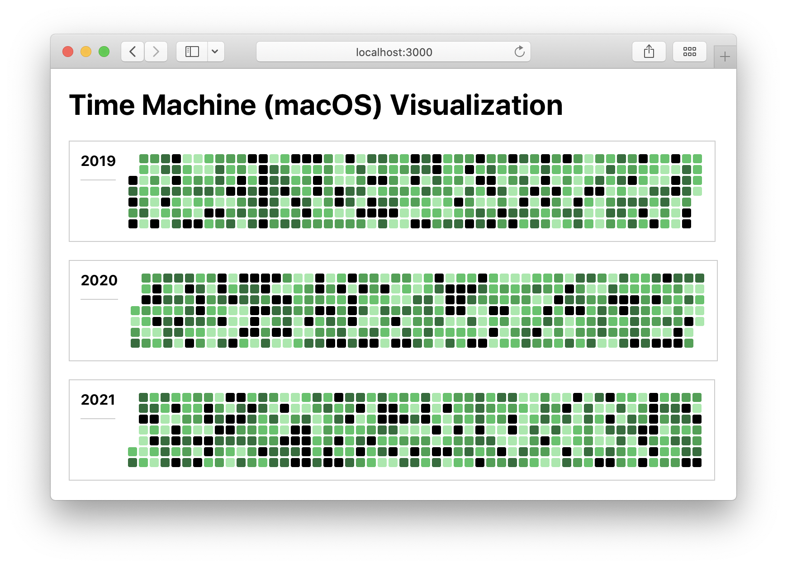

# Time Machine (macOS) Visualization

This project aims to provide a web-centric view of Time Machine backups.

[Time Machine](https://en.wikipedia.org/wiki/Time_Machine_%28macOS%29) is the backup mechanism of macOS, the desktop operating system developed by Apple. The software is designed to work with both local storage devices and network-attached disks, and is most commonly used with external disk drives connected using either USB or Thunderbolt.

Time Machine creates incremental backups of files that can be restored at a later date.

